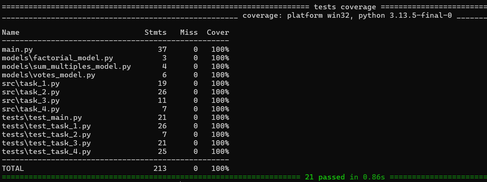

# Tarefa TINNOVA

Este repositório contém a solução para a tarefa de recrutamento da TINNOVA. O projeto foi desenvolvido em Python e utiliza o Pydantic para validação de dados, além de testes automatizados com Pytest.

### Considerações

 - Tomei a liberdade de criar uma aplicação CLI para facilitar na visualização das tarefas solicitadas no teste.

 - Optei por utilizar o Pydantic para validação de dados, garantindo que as entradas estejam corretas e evitando erros durante a execução. Sei que a tarefa não contempla o uso do Pydantic, mas considerei importante para a robustez do código.

 - Apliquei testes unitários para garantir a funcionalidade de cada tarefa, cobrindo casos de sucesso e falha.

 - Apliquei também cobertura de testes (coverage) para garantir que todas as funcionalidades estejam sendo testadas adequadamente.

 - Caso estivesse desenvolvendo em conjunto com o time, certamente traria esse ponto para discussão a fim de alinhar expectativas. Mas como se trata de um teste, aproveitei para mostrar o meu conhecimento e boas práticas de desenvolvimento.

 - Caso fosse necessário, poderia criar uma imagem docker e incluir num pipeline CI/CD, e no caso de aplicações sendo executadas em nuvem, tenho a capacidade de criar Infra por Código (IoC) com Terraform, Helm Charts.

## Estrutura do Projeto

- `main.py`: Ponto de entrada da aplicação, onde as tarefas são executadas e os resultados são exibidos.
- `src/`: Contém os módulos principais do projeto.
   - `task_1.py`: Cálculo de percentuais de votos válidos, brancos e nulos.
   - `task_2.py`: Implementação do algoritmo Bubble Sort.
   - `task_3.py`: Cálculo de fatoriais com validação de entrada.
   - `task_4.py`: Soma de múltiplos de números abaixo de um limite.
- `tests/`: Contém os testes automatizados para cada tarefa.
- `models/`: Contém os modelos Pydantic utilizados para validação de dados.

## Requisitos

- Python 3.13 ou superior
- Poetry para gerenciamento de dependências

## Instalação

### Caso esteja utilizando o ubuntu a instalação pode ser feita executando o `install.sh`

1. Clone o repositório:

   ```bash
   git clone https://github.com/brunomarques007/tarefa_tinnova.git
   cd tarefa_tinnova
   ```

2. Instale as dependências com o Poetry:

   ```bash
   poetry install
   ```

## Execução

### Scripts Individuais

Cada tarefa pode ser executada individualmente. Por exemplo:

```bash
poetry run python main.py <command>
```


### Testes Automatizados

Para rodar todos os testes:

```bash
poetry run pytest -pytest -s -x --cov=. -vv
```


## Cobertura de Testes
Para verificar a cobertura de testes, você pode usar o comando:

```bash
poetry run coverage html
```


## Contato

Para dúvidas ou sugestões, entre em contato com [@brunomarques007](https://github.com/brunomarques007).